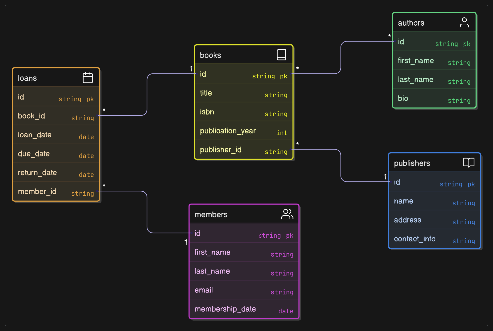

# 1. 函數相依性列表

以下是基於提供的資料需求（書籍、會員、借閱）識別的所有函數相依性（Functional Dependencies, FD）。這些相依性涵蓋初始資料集，並考慮正規化前的結構：

## 書籍 (Books)

- 主鍵：ISBN

- 函數相依性：

 1. ISBN → 書名, 出版社名稱, 出版年份, 書籍類別
 2. 出版社名稱 → 出版社地址（傳遞相依性，需分解）

 3. ISBN → 作者（多值屬性，需單獨處理）

- 註：作者是多值屬性，因此在正規化後會拆分到獨立表格。
  
## 會員 (Members)

- 主鍵：會員卡號

- 函數相依性：
  
1. 會員卡號 → 會員姓名, 會員地址, -會員電話, 會員Email

- 註：無其他非平凡相依性（假設會員姓名、會員地址等之間無相依性）。

## 借閱 (Loans)

- 主鍵：(會員卡號, ISBN, 借閱日期)（假設同一會員可多次借閱同一本書）

- 函數相依性：

1. (會員卡號, ISBN, 借閱日期) → 應還日期, 實際歸還日期
2. 會員卡號 → 會員姓名（部分相依性，需移除）
3. ISBN → 書名（部分相依性，需移除）

- 註：會員姓名和書名是冗餘屬性，應從其他表格取得。

### 完整函數相依性列表

1. ISBN → 書名, 出版社名稱, 出版年份, 書籍類別
2. 出版社名稱 → 出版社地址
3. ISBN → 作者（多值屬性）
4. 會員卡號 → 會員姓名, 會員地址, 會員電話, 會員Email
5. (會員卡號, ISBN, 借閱日期) → 應還日期, 實際歸還日期
6. 會員卡號 → 會員姓名（冗餘）
7. ISBN → 書名（冗餘）

# 2. 最終的ERD

最終的實體關係圖（ERD）基於正規化後的資料庫綱要（達到 BCNF）。由於無法直接繪製圖形，我以文字形式詳細描述實體、屬性、關係及主鍵/外鍵約束。

## 實體與屬性

- Publishers：
- 屬性：出版社名稱 (PK), 出版社地址
- 主鍵：出版社名稱

## Books

- 屬性：ISBN (PK), 書名, 出版社名稱 (FK), 出版年份, 書籍類別
- 主鍵：ISBN
- 外鍵：出版社名稱 參考 Publishers(出版社名稱)

## Authors

- 屬性：ISBN (PK, FK), 作者姓名 (PK)
- 主鍵：(ISBN, 作者姓名)
- 外鍵：ISBN 參考 Books(ISBN)

## Members

- 屬性：會員卡號 (PK), 會員姓名, 會員地址, 會員電話, 會員Email
- 主鍵：會員卡號

## Loans

- 屬性：會員卡號 (PK, FK), ISBN (PK, FK), 借閱日期 (PK), 應還日期, 實際歸還日期
- 主鍵：(會員卡號, ISBN, 借閱日期)
- 外鍵：會員卡號 參考 Members(會員卡號), ISBN 參考 Books(ISBN)

###　關係

- Publishers → Books：一對多（一個出版社可出版多本書，每本書屬於一個出版社）。
  - 透過 Books.publisher_name 外鍵關聯。
- Books → Authors：一對多（一本書可有多位作者，一位作者可撰寫多本書）。
  - 透過 Authors.isbn 外鍵關聯。
- Books → Loans：一對多（一本書可被多次借閱）。
  - 透過 Loans.isbn 外鍵關聯。
- Members → Loans：一對多（一位會員可有多筆借閱記錄）。
  - 透過 Loans.member_id 外鍵關聯。

### ERD 文字表示

## 說明

- 方框 [ ] 表示實體，括號 (1:N) 或 (N:1) 表示關係的多重性。

- 主鍵（PK）和外鍵（FK）明確標示，確保參考完整性。

- 關係反映實際業務邏輯，例如一本書可被多次借閱，但每次借閱只對應一位會員和一本書。

# 3. 正規化過程的文字說明

以下是將資料庫從初始結構正規化至第三正規化（3NF）並達到 BCNF 的過程，每一步驟附上理由：

## 初始結構

- Books：(ISBN, 書名, 作者, 出版社名稱, 出版社地址, 出版年份, 書籍類別)
- Members：(會員卡號, 會員姓名, 會員地址, 會員電話, 會員Email)
- Loans：(會員卡號, 會員姓名, ISBN, 書名, 借閱日期, 應還日期, 實際歸還日期)

### 問題：

- Books 中的 作者 是多值屬性，違反 1NF。
- Books 中 出版社名稱 → 出版社地址 是傳遞相依性，可能違反 3NF。
- Loans 中的 會員姓名 和 書名 是冗餘屬性，導致部分相依性（違反 2NF）和資料重複。
- 上述問題可能造成插入、更新、刪除異常（例如無法插入未借閱的書籍或會員，更新姓名需修改多個表格）。

## 第一正規化 (1NF)

- 目的：確保屬性值原子化，移除多值屬性和冗餘。
- 動作：

1. Books：
   - 將 作者 拆分到新表格 Authors：(ISBN, 作者姓名)，以處理多值屬性。
   - 將 出版社名稱 → 出版社地址 拆分到新表格 Publishers：(出版社名稱, 出版社地址)，以消除傳遞相依性。
   - 新表格：Books：(ISBN, 書名, 出版社名稱, 出版年份, 書籍類別)
2. Members：保持不變，已符合 1NF（所有屬性為原子值）。
3. Loans：
   - 移除冗餘屬性 會員姓名 和 書名，因為它們可透過 會員卡號 和 ISBN 從其他表格取得。
   - 新表格：Loans：(會員卡號, ISBN, 借閱日期, 應還日期, 實際歸還日期)

### 理由

- 多值屬性（作者）導致資料儲存和查詢複雜，拆分後確保原子性。
- 移除 Loans 中的冗餘屬性減少儲存空間並避免不一致（例如更新 會員姓名 時需修改多筆記錄）。
- 提前分解 Publishers 以便後續處理傳遞相依性。

## 第二正規化 (2NF)

- 目的：消除非主鍵屬性對複合主鍵的部分相依性。
- 動作：

1. Books：
   - 主鍵：ISBN
   - 函數相依性：ISBN → 書名, 出版社名稱, 出版年份, 書籍類別
   - 檢查：所有非主鍵屬性完全依賴於 ISBN，無部分相依性。
2. Authors：
   - 主鍵：(ISBN, 作者姓名)
   - 無非主鍵屬性，自動符合 2NF。
3. Publishers：
   - 主鍵：出版社名稱
   - 函數相依性：出版社名稱 → 出版社地址
   - 檢查：無部分相依性。
4. Members：
   - 主鍵：會員卡號
   - 函數相依性：會員卡號 → 會員姓名, 會員地址, 會員電話, 會員Email
   - 檢查：無部分相依性。
5. Loans：
   - 主鍵：(會員卡號, ISBN, 借閱日期)
   - 函數相依性：(會員卡號, ISBN, 借閱日期) → 應還日期, 實際歸還日期
   - 檢查：已移除 會員姓名 和 書名（部分相依性），現所有非主鍵屬性完全依賴於主鍵。

### 理由

- Loans 初始結構中的 會員卡號 → 會員姓名 和 ISBN → 書名 是部分相依性，移除這些屬性後符合 2NF。
- 其他表格的主鍵為單一屬性或無非主鍵屬性，無部分相依性問題。

## 第三正規化 (3NF)

- 目的：消除非主鍵屬性對非主鍵屬性的傳遞相依性。
- 動作：

1. Books：
   - 函數相依性：ISBN → 書名, 出版社名稱, 出版年份, 書籍類別
   - 檢查：出版社名稱 → 出版社地址 已分解到 Publishers，無傳遞相依性。
2. Authors：無非主鍵屬性，無傳遞相依性。
3. Publishers：出版社名稱 → 出版社地址，無傳遞相依性。
4. Members：會員卡號 → 會員姓名, 會員地址, 會員電話, 會員Email，無傳遞相依性（假設這些屬性之間無相依性）。
5. Loans：(會員卡號, ISBN, 借閱日期) → 應還日期, 實際歸還日期，無傳遞相依性。

### 理由

- Books 中的傳遞相依性 ISBN → 出版社名稱 → 出版社地址 在 1NF 階段已分解。
- 其他表格無非主鍵屬性對非主鍵屬性的相依性，符合 3NF。

## BCNF 檢查

- 目的：確保所有函數相依性的決定因素是候選鍵。
- 動作：
  - Books：決定因素 ISBN 是候選鍵，符合 BCNF。
  - Authors：無非主鍵屬性，符合 BCNF。
  - Publishers：決定因素 出版社名稱 是候選鍵，符合 BCNF。
  - Members：決定因素 會員卡號 是候選鍵，符合 BCNF。
  - Loans：決定因素 (會員卡號, ISBN, 借閱日期) 是候選鍵，符合 BCNF。
- 理由：所有表格的函數相依性均由候選鍵決定，無需進一步分解。

# 最終結構

- Publishers：(出版社名稱, 出版社地址)
- Books：(ISBN, 書名, 出版社名稱, 出版年份, 書籍類別)
- Authors：(ISBN, 作者姓名)
- Members：(會員卡號, 會員姓名, 會員地址, 會員電話, 會員Email)
- Loans：(會員卡號, ISBN, 借閱日期, 應還日期, 實際歸還日期)

## 正規化好處

- 消除資料冗餘（會員姓名、書名僅儲存一次）。
- 避免插入異常（可獨立新增書籍或會員）。
- 避免更新異常（更新姓名或書名只需修改單一表格）。
- 避免刪除異常（外鍵約束保留歷史借閱記錄的完整性）。
- 支援多作者書籍(透過 Authors 表格)