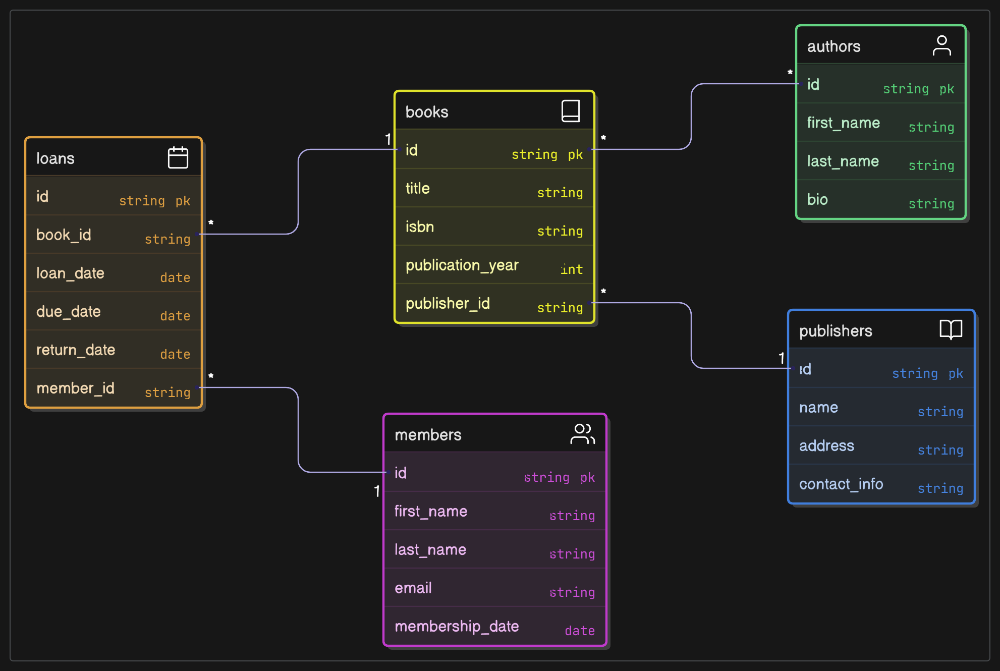

# 1. 函數相依性列表
假設初始資料以單一扁平化表格形式儲存，包含所有屬性：

## Orders_Flat

    (顧客ID, 顧客姓名, Email, 電話號碼, 街道, 城市, 郵遞區號, 國家,
    訂單ID, 訂單日期, 訂單總金額,
    產品ID, 產品名稱, 產品描述, 單價, 庫存數量, 供應商名稱, 供應商聯絡方式,
    購買數量)

從這個表格識別函數相依性（Functional Dependencies, FD）。以下是完整的函數相依性列表，考慮初始結構中的所有屬性：

1. 顧客相關：
   - 顧客ID → 顧客姓名, Email, 電話號碼, 街道, 城市, 郵遞區號, 國家
   - 郵遞區號 → 城市, 國家（假設郵遞區號唯一對應城市和國家）
2. 產品相關：
   - 產品ID → 產品名稱, 產品描述, 單價, 庫存數量, 供應商名稱, 供應商聯絡方式
   - 供應商名稱 → 供應商聯絡方式（假設同一供應商名稱對應唯一聯絡方式）
3. 訂單相關：

- 主鍵假設為 (訂單ID, 產品ID)（因為一個訂單可包含多個產品）。
- 函數相依性：
  - 訂單ID → 顧客ID, 訂單日期, 訂單總金額
  - (訂單ID, 產品ID) → 購買數量, 單價
  - 顧客ID → 顧客姓名, Email, 電話號碼, 街道, 城市, 郵遞區號, 國家（冗餘）
  - 產品ID → 產品名稱, 產品描述, 單價, 庫存數量, 供應商名稱, 供應商聯絡方式（冗餘）

## 完整函數相依性列表

1. 顧客ID → 顧客姓名, Email, 電話號碼, 街道, 城市, 郵遞區號, 國家
2. 郵遞區號 → 城市, 國家
3. 產品ID → 產品名稱, 產品描述, 單價, 庫存數量, 供應商名稱, 供應商聯絡方式
4. 供應商名稱 → 供應商聯絡方式
5. 訂單ID → 顧客ID, 訂單日期, 訂單總金額
6. (訂單ID, 產品ID) → 購買數量, 單價
7. 顧客ID → 顧客姓名（冗餘，來自訂單中的顧客資訊）
8. 產品ID → 產品名稱, 單價（冗餘，來自訂單中的產品資訊）

# 2.  正規化步驟的文字說明

以下是從單一扁平化表格正規化至第三正規化 (3NF) 的過程，每一步驟附上理由。

## 初始結構

## Orders_Flat

    (顧客ID, 顧客姓名, Email, 電話號碼, 街道, 城市, 郵遞區號, 國家,
    訂單ID, 訂單日期, 訂單總金額,
    產品ID, 產品名稱, 產品描述, 單價, 庫存數量, 供應商名稱, 供應商聯絡方式,
    購買數量)
## 問題

- 資料重複：顧客姓名、Email、產品名稱 等在多筆訂單中重複出現，浪費儲存空間並可能導致不一致。
- 多值屬性：一個訂單可能包含多個產品（產品ID, 產品名稱, 購買數量, 單價），違反第一正規化。
- 插入異常：無法插入尚未下單的顧客或未被訂購的產品。
- 更新異常：更改顧客 Email 或產品 單價 需更新所有相關記錄。
- 刪除異常：刪除訂單可能導致顧客或產品資訊丟失。

## 第一正規化 (1NF)

- 目的：確保屬性值原子化，移除多值屬性和冗餘屬性。
- 動作：
  1. 處理多值屬性：
     - 訂單中的多個產品（產品ID, 產品名稱, 購買數量, 單價）拆分到新表格：
     - Order_Items: (訂單ID, 產品ID, 購買數量, 單價)
  2. 移除冗餘屬性：
     - 移除 顧客姓名, Email, 電話號碼, 街道, 城市, 郵遞區號, 國家，因為這些可透過 顧客ID 從顧客表格取得。
     - 移除 產品名稱, 產品描述, 單價, 庫存數量, 供應商名稱, 供應商聯絡方式，因為這些可透過 產品ID 從產品表格取得。
  3. 分解表格：
     - Customers: (顧客ID, 顧客姓名, Email, 電話號碼, 街道, 城市, 郵遞區號, 國家)
     - Suppliers: (供應商名稱, 供應商聯絡方式)（處理 供應商名稱 → 供應商聯絡方式）
     - Products: (產品ID, 產品名稱, 產品描述, 單價, 庫存數量, 供應商名稱)
     - Orders: (訂單ID, 顧客ID, 訂單日期, 訂單總金額)
     - Order_Items: (訂單ID, 產品ID, 購買數量, 單價)
- 理由：
  - 多值屬性（多個產品）違反 1NF，拆分到 Order_Items 確保每個屬性值是單一值。
  - 冗餘屬性（顧客姓名, 產品名稱 等）導致資料重複，分解後減少儲存需求並避免更新異常。
  - 分離 Suppliers 提前處理傳遞相依性（供應商名稱 → 供應商聯絡方式）。

## 第二正規化 (2NF)

- 目的：消除非主鍵屬性對複合主鍵的部分相依性。
- 動作：
  1. Customers：
     - 主鍵：顧客ID
     - 函數相依性：顧客ID → 顧客姓名, Email, 電話號碼, 街道, 城市, 郵遞區號, 國家
     - 檢查：無複合主鍵，所有非主鍵屬性完全依賴 顧客ID，符合 2NF。
  2. Suppliers：
     - 主鍵：供應商名稱
     - 函數相依性：供應商名稱 → 供應商聯絡方式
     - 檢查：無複合主鍵，符合 2NF。
  3. Products：
     - 主鍵：產品ID
     - 函數相依性：產品ID → 產品名稱, 產品描述, 單價, 庫存數量, 供應商名稱
     - 檢查：無複合主鍵，所有非主鍵屬性完全依賴 產品ID，符合 2NF。
  4. Orders：
     - 主鍵：訂單ID
     - 函數相依性：訂單ID → 顧客ID, 訂單日期, 訂單總金額
     - 檢查：無複合主鍵，所有非主鍵屬性完全依賴 訂單ID，符合 2NF。
  5. Order_Items：
     - 主鍵：(訂單ID, 產品ID)
     - 函數相依性：(訂單ID, 產品ID) → 購買數量, 單價
     - 檢查：購買數量 和 單價 完全依賴於 (訂單ID, 產品ID)，無部分相依性（單價 儲存在 Order_Items 以記錄訂單時的實際價格，允許價格隨時間變化）。
- 理由：
  - 初始 Orders_Flat 中，產品ID → 產品名稱, 單價 和 顧客ID → 顧客姓名 是部分相依性，已通過分解移除。
  - Order_Items 確保所有非主鍵屬性完全依賴複合主鍵。

## 第三正規化 (3NF)

- 目的：消除非主鍵屬性對非主鍵屬性的傳遞相依性。
- 動作：
  1. Customers：
     - 函數相依性：顧客ID → 顧客姓名, Email, 電話號碼, 街道, 城市, 郵遞區號, 國家
     - 傳遞相依性：郵遞區號 → 城市, 國家
     - 分解：
       - ZipCodes: (郵遞區號, 城市, 國家)
       - Customers: (顧客ID, 顧客姓名, Email, 電話號碼, 街道, 郵遞區號)
       - 關係：郵遞區號 參考 ZipCodes(郵遞區號)
  2. Suppliers：
     - 函數相依性：供應商名稱 → 供應商聯絡方式
     - 檢查：無傳遞相依性，符合 3NF。
  3. Products：
     - 函數相依性：產品ID → 產品名稱, 產品描述, 單價, 庫存數量, 供應商名稱
     - 檢查：供應商名稱 已分解到 Suppliers，無傳遞相依性，符合 3NF。
  4. Orders：
     - 函數相依性：訂單ID → 顧客ID, 訂單日期, 訂單總金額
     - 檢查：無傳遞相依性，符合 3NF。
  5. Order_Items：
     - 函數相依性：(訂單ID, 產品ID) → 購買數量, 單價
     - 檢查：無傳遞相依性，符合 3NF。
- 理由：
  - Customers 中的 郵遞區號 → 城市, 國家 是傳遞相依性，分解到 ZipCodes 消除此問題。
  - 其他表格無非主鍵屬性對非主鍵屬性的相依性，符合 3NF。

## 最終綱要 (3NF)

- ZipCodes:
  - 屬性：(郵遞區號, 城市, 國家)
  - 主鍵：郵遞區號
- Customers:
  - 屬性：(顧客ID, 顧客姓名, Email, 電話號碼, 街道, 郵遞區號)
  - 主鍵：顧客ID
  - 關係：郵遞區號 參考 ZipCodes(郵遞區號)
- Suppliers:
  - 屬性：(供應商名稱, 供應商聯絡方式)
  - 主鍵：供應商名稱
- Products:
  - 屬性：(產品ID, 產品名稱, 產品描述, 單價, 庫存數量, 供應商名稱)
  - 主鍵：產品ID
  - 關係：供應商名稱 參考 Suppliers(供應商名稱)
- Orders:
  - 屬性：(訂單ID, 顧客ID, 訂單日期, 訂單總金額)
  - 主鍵：訂單ID
  - 關係：顧客ID 參考 Customers(顧客ID)
- Order_Items:
  - 屬性：(訂單ID, 產品ID, 購買數量, 單價)
  - 主鍵：(訂單ID, 產品ID)
  - 關係：訂單ID 參考 Orders(訂單ID), 產品ID 參考 Products(產品ID)

### 好處

- 消除資料冗餘（顧客姓名、產品名稱 等僅儲存一次）。
- 避免插入異常（可新增未下單的顧客或產品）。
- 避免更新異常（更新顧客或產品資訊只需修改單一表格）。
- 避免刪除異常（關係約束保留歷史訂單記錄）。
- 支援訂單包含多個產品（透過 Order_Items）。
# 3. 最終的 ERD
以下是正規化後的實體關係圖（ERD）文字描述，包含實體、屬性、關係和多重性：

## 實體與屬性：
- ZipCodes：
  - 屬性：郵遞區號 (PK), 城市, 國家
  - 主鍵：郵遞區號
- Customers：
  - 屬性：顧客ID (PK), 顧客姓名, Email, 電話號碼, 街道, 郵遞區號 (FK)
  - 主鍵：顧客ID
  - 外鍵：郵遞區號 參考 ZipCodes(郵遞區號)
- Suppliers：
  - 屬性：供應商名稱 (PK), 供應商聯絡方式
  - 主鍵：供應商名稱
- Products：
  - 屬性：產品ID (PK), 產品名稱, 產品描述, 單價, 庫存數量, 供應商名稱 (FK)
  - 主鍵：產品ID
  - 外鍵：供應商名稱 參考 Suppliers(供應商名稱)
- Orders：
  - 屬性：訂單ID (PK), 顧客ID (FK), 訂單日期, 訂單總金額
  - 主鍵：訂單ID
  - 外鍵：顧客ID 參考 Customers(顧客ID)
- Order_Items：
  - 屬性：訂單ID (PK, FK), 產品ID (PK, FK), 購買數量, 單價
  - 主鍵：(訂單ID, 產品ID)
  - 外鍵：訂單ID 參考 Orders(訂單ID), 產品ID 參考 Products(產品ID)

## 關係

- ZipCodes → Customers：一對多（一個郵遞區號對應多個顧客地址）。
  - 透過 Customers.zip_code 關聯。
- Suppliers → Products：一對多（一個供應商提供多個產品）。
  - 透過 Products.supplier_name 關聯。
- Customers → Orders：一對多（一個顧客可有多筆訂單）。
  - 透過 Orders.customer_id 關聯。
- Orders → Order_Items：一對多（一個訂單包含多個訂單項目）。
  - 透過 Order_Items.order_id 關聯。
- Products → Order_Items：一對多（一個產品可出現在多個訂單項目中）。
  - 透過 Order_Items.product_id 關聯。

## ERD 文字表示：

## 說明

- 方框 [ ] 表示實體，括號 (1:N) 或 (N:1) 表示關係的多重性。
- 主鍵 (PK) 和外鍵 (FK) 明確標示，確保參考完整性。
- 關係反映業務邏輯：顧客下訂單，訂單包含多個產品項目，產品來自供應商，顧客地址參考郵遞區號。

# 4. 總結

- 函數相依性列表：
  - 顧客：顧客ID → 顧客姓名, Email, 電話號碼, 街道, 城市, 郵遞區號, 國家, 郵遞區號 → 城市, 國家
  - 產品：產品ID → 產品名稱, 產品描述, 單價, 庫存數量, 供應商名稱, 供應商名稱 → 供應商聯絡方式
  - 訂單：訂單ID → 顧客ID, 訂單日期, 訂單總金額, (訂單ID, 產品ID) → 購買數量, 單價
  - 冗餘：顧客ID → 顧客姓名, 產品ID → 產品名稱, 單價
- 正規化步驟的文字說明：
  - 1NF：移除多值屬性（多個產品）至 Order_Items，分解顧客、產品、供應商資訊至獨立表格，移除冗餘屬性。
  - 2NF：確保非主鍵屬性完全依賴主鍵，移除 Order_Items 中的部分相依性（產品ID → 產品名稱 等）。
  - 3NF：分解 Customers 中的傳遞相依性（郵遞區號 → 城市, 國家）至 ZipCodes，其他表格已無傳遞相依性。
  - 最終形成六個表格，消除資料冗餘和異常。

- 最終 ERD：描述六個實體（ZipCodes, Customers, Suppliers, Products, Orders, Order_Items）及其關係，支援業務需求並確保資料一致性。