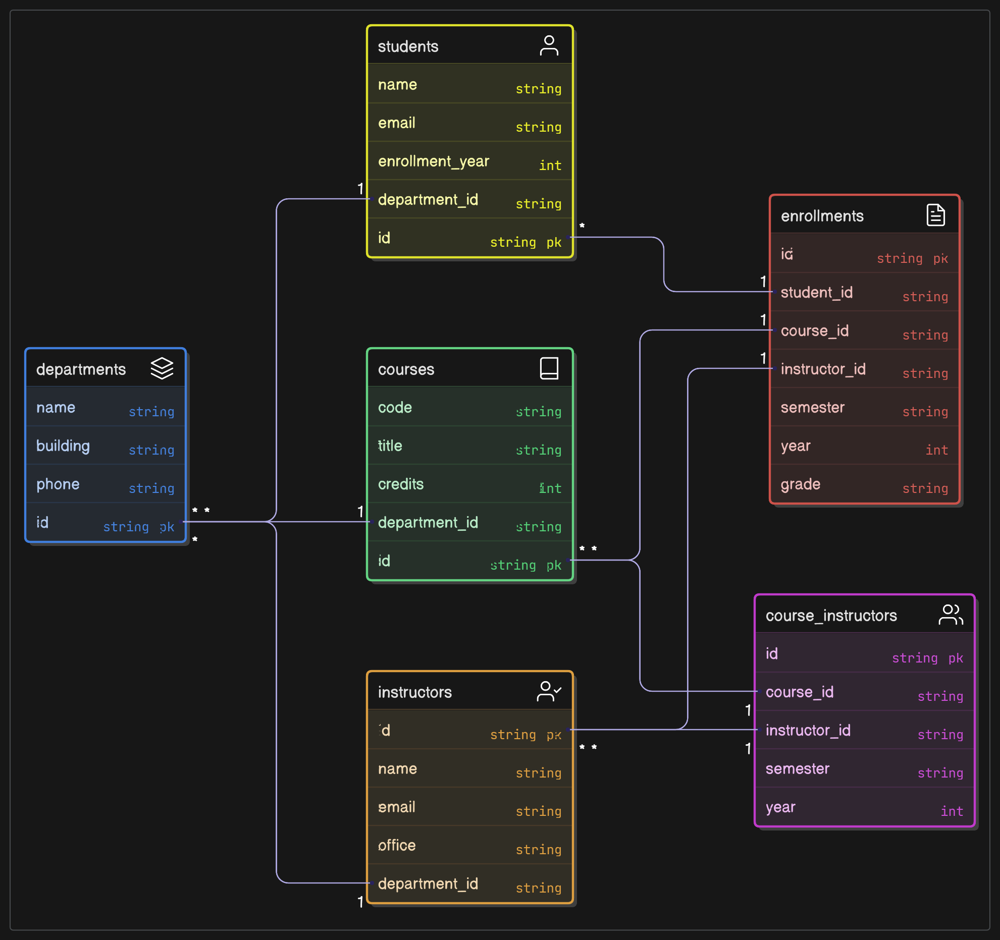

# 1. 函數相依性列表

## 初始扁平化表格
假設初始資料以單一表格形式儲存，包含所有屬性：

## Enrollment_Flat:

    (學號, 學生姓名, 主修科系名稱, 主修科系辦公室地點,
    課程代碼, 課程名稱, 學分數, 開課系所代碼, 開課系所名稱,
    講師編號, 講師姓名, 講師所屬系所代碼, 講師所屬系所名稱, 講師辦公室號碼,
    學期, 成績)

## 函數相依性分析
根據情境（一位講師可教授多門課程，一門課程可由多位講師教授；學生選修特定學期的課程，由特定講師授課），以下是完整的函數相依性列表：

1. 學生相關：
   - 學號 → 學生姓名, 主修科系名稱, 主修科系辦公室地點
   - 主修科系名稱 → 主修科系辦公室地點（假設同一科系名稱對應唯一辦公室地點）
2. 課程相關：
   - 課程代碼 → 課程名稱, 學分數, 開課系所代碼
   - 開課系所代碼 → 開課系所名稱（假設同一系所代碼對應唯一名稱）
3. 講師相關：
   - 講師編號 → 講師姓名, 講師所屬系所代碼, 講師辦公室號碼
   - 講師所屬系所代碼 → 講師所屬系所名稱（假設同一系所代碼對應唯一名稱）
4. 選課記錄相關：
   - 主鍵：(學號, 課程代碼, 學期)（學生在特定學期選修特定課程）
   - 函數相依性：
     - (學號, 課程代碼, 學期) → 授課講師編號, 成績
     - 學號 → 學生姓名, 主修科系名稱, 主修科系辦公室地點（冗餘）
     - 課程代碼 → 課程名稱, 學分數, 開課系所代碼（冗餘）
     - 開課系所代碼 → 開課系所名稱（冗餘）
     - 授課講師編號 → 講師姓名, 講師所屬系所代碼, 講師辦公室號碼（冗餘）
     - 講師所屬系所代碼 → 講師所屬系所名稱（冗餘）
5. 課程與講師關係：
   - (課程代碼, 講師編號, 學期) → (授課關係)（表示某講師在某學期教授某課程，多對多關係）
## 完整函數相依性列表：

1. 學號 → 學生姓名, 主修科系名稱, 主修科系辦公室地點
1. 主修科系名稱 → 主修科系辦公室地點
1. 課程代碼 → 課程名稱, 學分數, 開課系所代碼
1. 開課系所代碼 → 開課系所名稱
1. 講師編號 → 講師姓名, 講師所屬系所代碼, 講師辦公室號碼
1. 講師所屬系所代碼 → 講師所屬系所名稱
1. (學號, 課程代碼, 學期) → 授課講師編號, 成績
1. 學號 → 學生姓名（冗餘）
1. 課程代碼 → 課程名稱（冗餘）
1. 授課講師編號 → 講師姓名（冗餘）
1. (課程代碼, 講師編號, 學期) → (授課關係)
# 2. 最終的 ERD
以下是正規化後的實體關係圖（ERD）文字描述，基於最終的資料庫綱要（3NF/BCNF）。ERD 包含實體、屬性、關係和多重性。

## 實體與屬性
- Departments:
  - 屬性：系所代碼 (PK), 系所名稱, 辦公室地點
  - 主鍵：系所代碼
- Students:
  - 屬性：學號 (PK), 學生姓名, 主修科系代碼 (FK)
  - 主鍵：學號
  - 外鍵：主修科系代碼 參考 Departments(系所代碼)
- Courses:
  - 屬性：課程代碼 (PK), 課程名稱, 學分數, 開課系所代碼 (FK)
  - 主鍵：課程代碼
  - 外鍵：開課系所代碼 參考 Departments(系所代碼)
- Instructors:
  - 屬性：講師編號 (PK), 講師姓名, 講師所屬系所代碼 (FK), 講師辦公室號碼
  - 主鍵：講師編號
  - 外鍵：講師所屬系所代碼 參考 Departments(系所代碼)
- Course_Instructors:
  - 屬性：課程代碼 (PK, FK), 講師編號 (PK, FK), 學期 (PK)
  - 主鍵：(課程代碼, 講師編號, 學期)
  - 外鍵：課程代碼 參考 Courses(課程代碼), 講師編號 參考 Instructors(講師編號)
- Enrollments:
  - 屬性：學號 (PK, FK), 課程代碼 (PK, FK), 學期 (PK), 授課講師編號 (FK), 成績
  - 主鍵：(學號, 課程代碼, 學期)
  - 外鍵：學號 參考 Students(學號), 課程代碼 參考 Courses(課程代碼), (課程代碼, 授課講師編號, 學期) 參考 Course_Instructors(課程代碼, 講師編號, 學期)

## 關係

- Departments → Students：一對多（一個系所可有多名學生主修）。
  - 透過 Students.主修科系代碼 關聯。
- Departments → Courses：一對多（一個系所可開設多門課程）。
  - 透過 Courses.開課系所代碼 關聯。
- Departments → Instructors：一對多（一個系所可有多名講師）。
  - 透過 Instructors.講師所屬系所代碼 關聯。
- Courses → Course_Instructors：一對多（一門課程可由多位講師在不同學期教授）。
  - 透過 Course_Instructors.課程代碼 關聯。
- Instructors → Course_Instructors：一對多（一位講師可教授多門課程）。
  - 透過 Course_Instructors.講師編號 關聯。
- Students → Enrollments：一對多（一名學生可有多筆選課記錄）。
  - 透過 Enrollments.學號 關聯。
- Courses → Enrollments：一對多（一門課程可有多名學生選修）。
  - 透過 Enrollments.課程代碼 關聯。
- Course_Instructors → Enrollments：一對多（一個課程-講師-學期組合對應多筆選課記錄）。
  - 透過 Enrollments(課程代碼, 授課講師編號, 學期) 關聯。

## ERD 文字表示

## 說明

- 方框 [ ] 表示實體，括號 (1:N) 或 (N:1) 表示關係的多重性。
- 主鍵 (PK) 和外鍵 (FK) 明確標示，確保參考完整性。
- Course_Instructors 處理課程與講師的多對多關係，Enrollments 確保選課記錄與授課安排一致。

# 3. 設計原則及說明

## 正規化過程

從單一扁平化表格 Enrollment_Flat 正規化至 BCNF 的過程如下：

1. 第一正規化 (1NF)：
   - 目的：移除多值屬性和冗餘屬性，確保屬性值原子化。
   - 動作：
     - 分解課程與講師的多對多關係至 Course_Instructors：(課程代碼, 講師編號, 學期)。
     - 分解選課記錄至 Enrollments：(學號, 課程代碼, 學期, 授課講師編號, 成績)，移除冗餘屬性（如 學生姓名, 課程名稱）。
     - 分解學生、課程、講師和系所資訊：
       - Departments: (系所代碼, 系所名稱, 辦公室地點)
       - Students: (學號, 學生姓名, 主修科系代碼)
       - Courses: (課程代碼, 課程名稱, 學分數, 開課系所代碼)
       - Instructors: (講師編號, 講師姓名, 講師所屬系所代碼, 講師辦公室號碼)
   - 理由：
       - 多值屬性（課程與講師的授課關係）違反 1NF，拆分至 Course_Instructors。
       - 冗餘屬性（如 學生姓名, 課程名稱）導致資料重複，分解減少儲存需求並避免更新異常。
       - 統一系所資訊至 Departments，避免重複儲存。

2. 第二正規化 (2NF)：
   - 目的：消除非主鍵屬性對複合主鍵的部分相依性。
   - 動作：
     - Enrollments：主鍵 (學號, 課程代碼, 學期)，確保 授課講師編號 和 成績 完全依賴主鍵，移除 學生姓名 等部分相依屬性。
     - 其他表格（Departments, Students, Courses, Instructors, Course_Instructors）無部分相依性，符合 2NF。
   - 理由：
     - 初始表格中的 學號 → 學生姓名 和 課程代碼 → 課程名稱 是部分相依性，已通過分解移除。
3. 第三正規化 (3NF)：
   - 目的：消除非主鍵屬性對非主鍵屬性的傳遞相依性。
   - 動作：
     - Departments 處理 主修科系名稱 → 主修科系辦公室地點 和 開課系所代碼 → 開課系所名稱。
     - 其他表格無傳遞相依性，符合 3NF。
   - 理由：
     - 傳遞相依性（如 主修科系名稱 → 主修科系辦公室地點）已分解至 Departments。
4. Boyce-Codd 正規化 (BCNF)：
   - 目的：確保所有函數相依性的決定因素是候選鍵。
   - 動作：
     - 所有表格的決定因素（系所代碼, 學號, 課程代碼, 講師編號, (課程代碼, 講師編號, 學期), (學號, 課程代碼, 學期)）均為候選鍵，符合 BCNF。
     - Enrollments 的 (學號, 課程代碼, 學期) → 授課講師編號, 成績 符合 BCNF，但需確保 授課講師編號 參考 Course_Instructors。
   - 挑戰：
     - Enrollments 中的 授課講師編號 依賴於 Course_Instructors(課程代碼, 講師編號, 學期)，需複合外鍵約束，增加設計複雜性。
     - 進一步分解（例如分離 成績）會增加表格數量，導致查詢需更多聯結，影響效能。
   - 決策：
     - 保留 3NF 結構，透過參考約束確保 Enrollments 的 授課講師編號 與 Course_Instructors 一致。BCNF 的嚴格分解可能導致過多表格，3NF 已解決主要異常（冗餘、插入、更新、刪除）。

## 設計原則

- 資料一致性：分解冗餘屬性（學生姓名, 課程名稱 等僅儲存一次），使用外鍵約束確保參考完整性。
- 異常消除：
  - 插入：可新增尚未選課的學生、課程或講師。
  - 更新：更新學生姓名或課程資訊只需修改單一表格。
  - 刪除：參考約束保留歷史選課記錄。
- 靈活性：支援課程與講師的多對多關係（透過 Course_Instructors），以及學生在不同學期選修課程的需求。
- 查詢效率：避免過度分解，保持適當表格數量，方便聯結查詢（如選課記錄、課程安排）。
- 業務邏輯：Course_Instructors 確保課程與講師的授課關係明確，Enrollments 記錄學生選課與成績，並與授課安排一致。

## 設計決策

- 選擇 3NF 而非嚴格 BCNF：
  - 理由：Enrollments 的結構在 3NF 下已消除冗餘和異常，透過參考 Course_Instructors 確保講師正確性。BCNF 的進一步分解（例如分離 成績）會增加表格數量，導致查詢複雜性和效能下降。
  - 實務考量：大學課程註冊系統需頻繁查詢選課記錄、課程安排和成績，較少的表格數量有利於簡化查詢和維護。
- 統一系所資訊：將主修和開課系所統一至 Departments，避免重複儲存系所名稱和辦公室地點。
- 多對多關係：Course_Instructors 納入 學期 屬性，區分不同學期的授課安排，支援靈活的業務需求。
  
## 正規化挑戰

- 多對多關係：課程與講師的多對多關係需 Course_Instructors 表格，並納入 學期 以區分授課時段，增加了主鍵複雜性。
- 複合外鍵：Enrollments 的 (課程代碼, 授課講師編號, 學期) 需參考 Course_Instructors，這在資料庫實現中需要複合外鍵約束，增加了設計和驗證的複雜性。
- BCNF vs. 3NF：BCNF 要求嚴格，但過度分解可能導致查詢效率低下。3NF 透過參考約束已滿足資料一致性和異常消除的需求。
  
# 4. 總結

- 函數相依性列表：
  - 學生：學號 → 學生姓名, 主修科系名稱, 主修科系辦公室地點, 主修科系名稱 → 主修科系辦公室地點
  - 課程：課程代碼 → 課程名稱, 學分數, 開課系所代碼, 開課系所代碼 → 開課系所名稱
  - 講師：講師編號 → 講師姓名, 講師所屬系所代碼, 講師辦公室號碼, 講師所屬系所代碼 → 講師所屬系所名稱
  - 選課：(學號, 課程代碼, 學期) → 授課講師編號, 成績
  - 授課關係：(課程代碼, 講師編號, 學期) → (授課關係)
  - 冗餘：學號 → 學生姓名, 課程代碼 → 課程名稱, 授課講師編號 → 講師姓名
- 最終 ERD：
  - 六個實體：Departments, Students, Courses, Instructors, Course_Instructors, Enrollments
  - 關係支援多對多（課程-講師）和選課記錄的業務邏輯，確保參考完整性。
- 設計原則及說明：
  - 正規化至 3NF，符合 BCNF，但選擇 3NF 以平衡查詢效率和資料完整性。
  - 挑戰包括處理多對多關係和複合外鍵，透過 Course_Instructors 和參考約束解決。
  - 設計消除冗餘和異常，支援靈活的課程註冊需求。